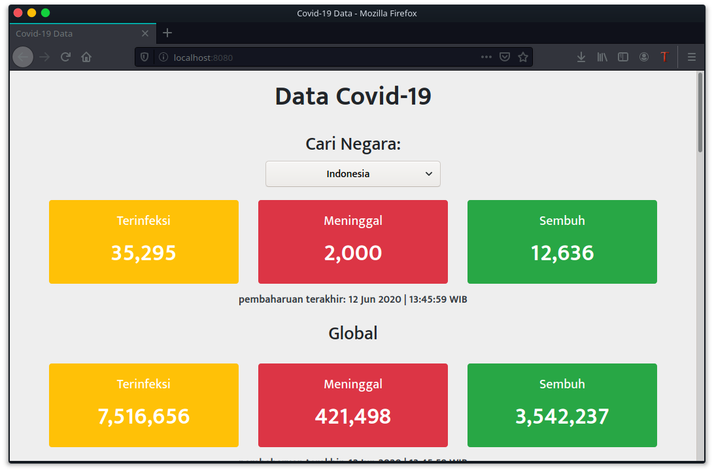
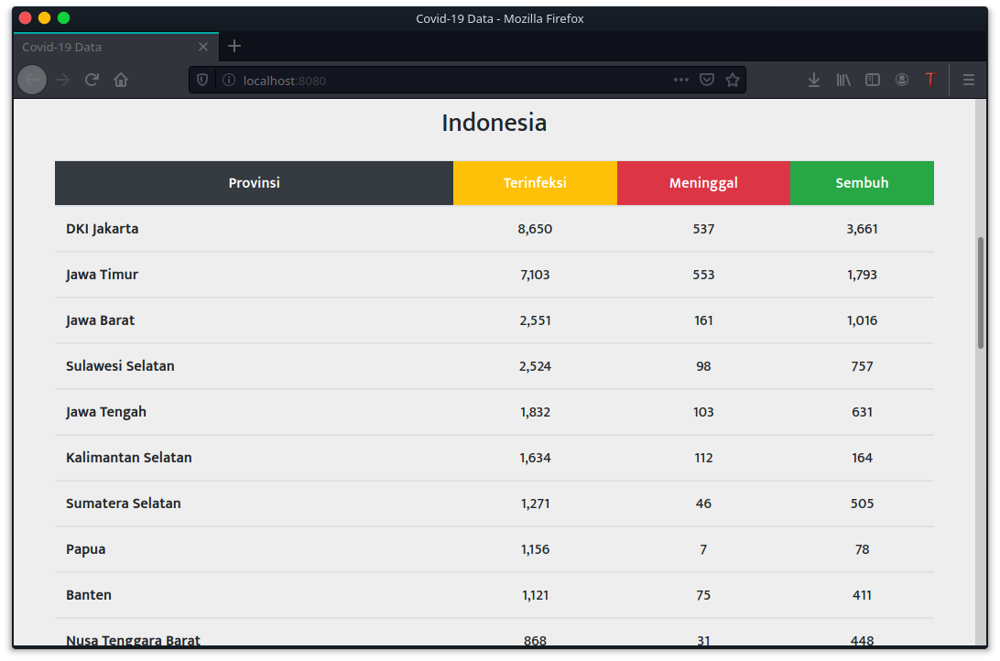

# covid-19-stat

<p align="center">
  
</p>

<p align="center">
  
</p>

## Installation

First, use the package manager [npm](https://www.npmjs.com/get-npm) to install packages required by covid-19-stat.

```bash
npm install
```

run with development mode:
```bash
npm run start-dev
```
covid-19-stat is running at http://localhost:8080/

build:
```bash
npm run build
```
the output documents located in dist/ folder.

## Contributing
Pull requests are welcome. 
